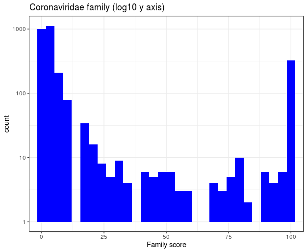
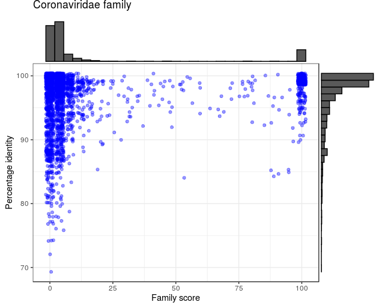
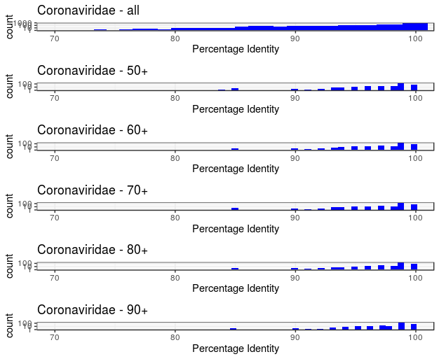
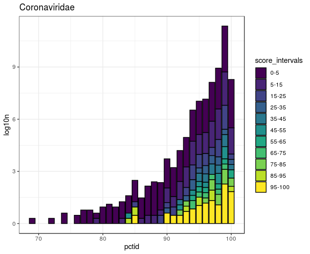
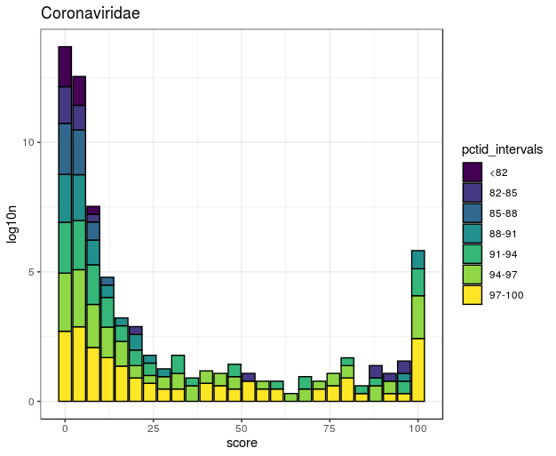
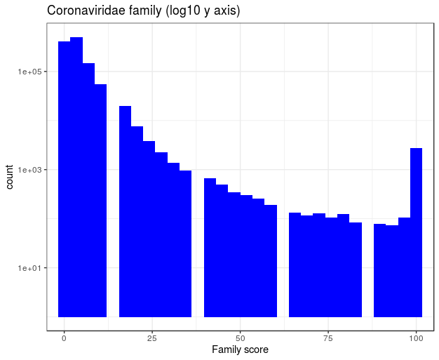
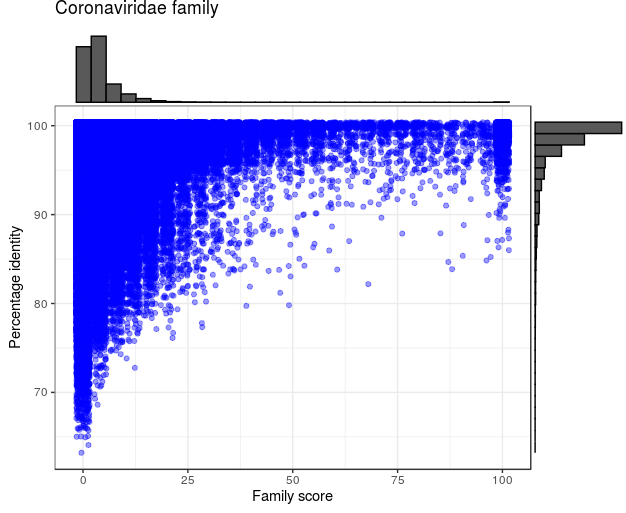
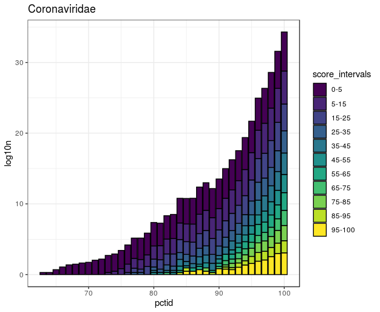
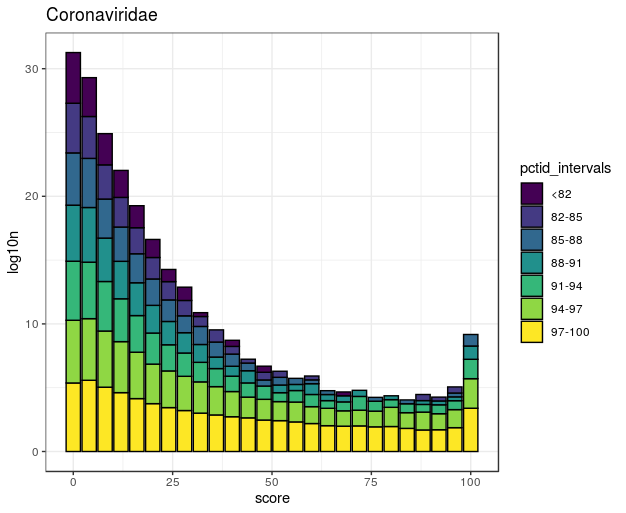

# Tantalus

An R package for exploration of [Serratus](https://github.com/ababaian/serratus) data.


## Installation
To install directly from the repo:

```
install.packages("devtools")
library(devtools)
install.packages("plotly")

install_github("serratus-bio/tantalus")
```

Note, if you install tantalus with R version <3.6.0, then you first need to install older version of pbkrtest:

```
packageurl <- "http://cran.r-project.org/src/contrib/Archive/pbkrtest/pbkrtest_0.4-7.tar.gz"
install.packages(packageurl, repos=NULL, type="source")
```

## The parsing of Serratus summary files

To better understand Serratus output, we developed Tantalus R package, which parses input files from Serratus and gives a relevant statistics/plots. Due to huge size of the data sets (up to 1M files) it's impractical to load all the data into R, therefore, we use object serialization: every summary file is processed into two compressed data frames; one contains family information, another has accessions.  

To run examples below make sure you have imported **tantalus** in your environment:

```R
library("tantalus")
```

### Example of parsing data files

Let's say we need to parse VIRO data set. For this we first need to know, which files (SRA accessions) belong to this data set. We can retrieve this information from **viro_SraRunInfo.csv** file. 

```R
#parse sra file into SraRunInfo object
viro_sra <- readSraRunInfo("../sra/viro_SraRunInfo.csv")
```

Now imagine you have a folder with summary files from all data sets. You need to load only those that correspond to VIRO data set:

```R
#list all summary files in the folder
sumWheres_all <- paste("../summary_files/", system( paste0("ls ", "../summary_files/"), intern = T), sep="/")

#convert all SRA accessions from viro_sra object to file format
summary_files <- paste(viro_sra@runInfo$Run, "summary", sep=".")
sumWheres <- paste("../summary_files/", summary_files, sep="/")

#remove files that are absent in the specified folder
#and analyze only those that intersect with Viro data set
files_to_analyze <- intersect(sumWheres_all, sumWheres)
```

Now we need to parse summary files into family and accession data frames. We do this using **fst** package functionality and the following functions:

```R
#parse Families
parseSummaryFiles(files_to_analyze, outputFolder="../viro/viro_F/", parseFamily=T)

#parse Accessions
parseSummaryFiles(files_to_analyze, outputFolder="../viro/viro_Acc/", parseFamily=F)
```

Now we can load these dfs into R. Again, for some data sets it can take a lot of memory/time, so we can either load a subset of sras or just a specified columns:

```R
#read all family dfs
DATA_PATH='../viro/viro_F/'
sumWheres <- paste0( DATA_PATH,
                     system( paste0("ls ", DATA_PATH), intern = T ))

#read all columns
viro <- readDFs(sumWheres, all=T)
#read subset of columns
viro <- readDFs(sumWheres, all=F, columns = c("sra","score", "pctid", "family"))

#if you are interested in specific SRAs
subset_of_sras <- c("DRR053207", "DRR053211", "DRR053215")
subset_of_sras <- paste(subset_of_sras, "fst", sep=".")
subset_of_files <- unique (grep(paste(subset_of_sras,collapse="|"), 
                        sumWheres, value=TRUE))

viro_subset <- readDFs(subset_of_files, all=F, columns = c("sra","score", "pctid", "family"))
```

Now we can use this data frame to do plots:

```R
#plot fscore histogram
familyScore(viro, "Coronaviridae", log=T)
```


```R
#plot fscore/pctid histogram/scatterplot
x <- familyScorPctID(viro, "Coronaviridae")
x
```


```R
#plot pctid histograms
library("grid")
p1 <- familyPctID(viro, "Coronaviridae", score_threshold = 0, title="Coronaviridae - all", x1=70, x2=100, log=T)
p2 <- familyPctID(viro, "Coronaviridae", score_threshold = 50, title="Coronaviridae - 50+", x1=70, x2=100, log=T)
p3 <- familyPctID(viro, "Coronaviridae", score_threshold = 60, title="Coronaviridae - 60+", x1=70, x2=100, log=T)
p4 <- familyPctID(viro, "Coronaviridae", score_threshold = 70, title="Coronaviridae - 70+", x1=70, x2=100, log=T)
p5 <- familyPctID(viro, "Coronaviridae", score_threshold = 80, title="Coronaviridae - 80+", x1=70, x2=100, log=T)
p6 <- familyPctID(viro, "Coronaviridae", score_threshold = 90, title="Coronaviridae - 90+", x1=70, x2=100, log=T)

grid.newpage()
grid.draw(rbind(ggplotGrob(p1),
                ggplotGrob(p2),
                ggplotGrob(p3),
                ggplotGrob(p4),
                ggplotGrob(p5),
                ggplotGrob(p6),
                size = "last"))
```



```R
#plot pctid histogram with family score intervals
pctidInScoreIntervals(viro, "Coronaviridae", title="Coronaviridae")
```



```R
#plot score histogram with pctid intervals
scoreInPctidIntervals(viro, "Coronaviridae", title="Coronaviridae")
```



## Database analysis

Instead of fst data frames, the data can be obtained from the Postgres SQL database:

```R
library("tantalus")
library("dbplyr")
library("RPostgreSQL") 

drv <- DBI::dbDriver("PostgreSQL")
con <- DBI::dbConnect(drv, 
                      user="postgres", 
                      password="serratus",
                      host="big-parse-db.ccz9y6yshbls.us-east-1.rds.amazonaws.com", 
                      port=5432, 
                      dbname="postgres")
#with a database
##tbls: __EFMigrationsHistory, AccessionSections, FamilySections, FastaSections, Runs

#get Family table, and Coronaviridae family
x <- readDfSQL(con, "FamilySections", family = "Coronaviridae")

#get specific SRAs
sras <- c("SRR10144611", "SRR6906297", "SRR6906298",  "SRR6906299", 
          "SRR6906300", "SRR6906303", "SRR3229029", "SRR3229077", 
          "SRR3229078", "SRR3229081")

x <- readDfSQL(con, "FamilySections", family = "Coronaviridae", sras = sras)
```


Essentially everything else remains the same. However, if we want to do plots, we need to convert the database list into dataframe and rename the columns to their old names:

```R
#convert database output into dataframe
x <- readDfSQL(con, "FamilySections", family = "Coronaviridae", columns = c("Sra","Score", "PctId", "Family"), dataframe = T)
dim(x) #1163633       4

colnames(x) <- tolower(colnames(x))

familyScore(x, "Coronaviridae", log=T)
```



```R
y <- familyScorPctID(x, "Coronaviridae")
y
```



```R
#plot pctid histogram with family score intervals
pctidInScoreIntervals(x, "Coronaviridae", title="Coronaviridae")
```



```R
#plot score histogram with pctid intervals
scoreInPctidIntervals(x, "Coronaviridae", title="Coronaviridae")
```


