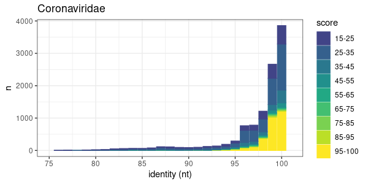
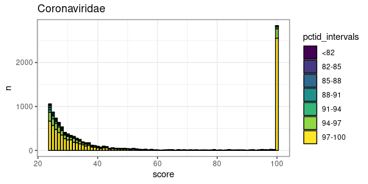
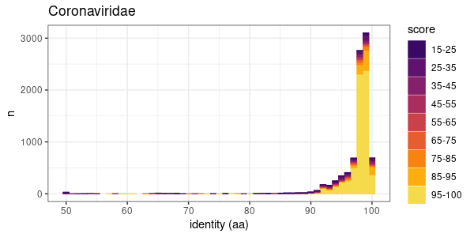

# Tantalus

An R package for exploration of [Serratus](https://github.com/ababaian/serratus) data.


## Upgrade in Progress

We are currently upgrading to a new database server. Some functions may be broken. Please open an [issue](https://github.com/serratus-bio/tantalus/issues) if a problem arises.

## Installation
To install directly from the repo:

```
install.packages("devtools")
library(devtools)

install_github("serratus-bio/tantalus")
```

(Optional) For more efficient data-access, install `aws-cli`and input your credentials with `aws-cli`. Then add the system environmental variables from your R workspace, be sure to use `us-east-1`.

```
Sys.setenv(
  "AWS_ACCESS_KEY_ID" = "my_public_key",
  "AWS_SECRET_ACCESS_KEY" = "my_secret_key",
  "AWS_DEFAULT_REGION" = "us-east-1"
)
```

Note, if you install tantalus with R version <3.6.0, then you first need to install older version of pbkrtest:

```
packageurl <- "http://cran.r-project.org/src/contrib/Archive/pbkrtest/pbkrtest_0.4-7.tar.gz"
install.packages(packageurl, repos=NULL, type="source")
```

## Usage example

To load data with **tantalus** you should import RPostgresSQL and dbplyr packages:

```R
library("tantalus")
library("dbplyr")
library("RPostgres") 

# Connect to Serratus Database
drv <- DBI::dbDriver("PostgreSQL")
con <- DBI::dbConnect(drv,
                      user="public_reader", 
                      password="serratus",
                      host="serratus-aurora-20210310.cluster-ro-ccz9y6yshbls.us-east-1.rds.amazonaws.com",
                      port=5432, 
                      dbname="summary")

# Retrieve nucleotide family table, and Coronaviridae family
# specific columns
cov.nt <- readDfSQL(con,
                   table = "nfamily",
                   family = "Coronaviridae",
                   columns = c('run_id', 'score', 'percent_identity', 'family_name'),
                   score = 24, 
                   dataframe = T)
               
# Retrieve a sub-set of SRA by accessions
sra.accessions <- c("SRR10144611", "SRR6906297", "SRR6906298",  "SRR6906299",
                    "SRR6906300", "SRR6906303", "SRR3229029", "SRR3229077", 
                    "SRR3229078", "SRR3229081")

cov.nt.sra <- readDfSQL(con,
                   table = "nfamily",
                   family = "Coronaviridae",
                   sras = sra.accessions,
                   columns = c('run_id', 'score', 'percent_identity', 'family_name'),
                   dataframe = T)

# Retrieve rdrp-search results for Coronaviridae
cov.rdrp <- readDfSQL(con,
                      table = "rfamily",
                      family = "Coronaviridae-1",
                      columns = c('run_id', 'score', 'percent_identity', 'family_name'),
                      score = 24, 
                      dataframe = T)

```

Plot examples:

```R
# Plot Nucleotide Identity vs. Abundance histogram with identification scores
nt.hist <- pctidInScoreIntervals(cov.nt, family_name = "Coronaviridae", title="Coronaviridae",
                                 scale_log = F, bin_scores = T)
nt.hist
```



```R
#plot pctid histogram with family score intervals
score.dist <- scoreInPctidIntervals(cov.nt, title="Coronaviridae",
                      scale_log = F, bin_percent = T)
score.dist
```



```R
# Plot RdRP Identity vs. Abundance histogram with identification scores
rdrp.hist <- pctidInScoreIntervals(cov.rdrp, family_name = "Coronaviridae-1", title="Coronaviridae",
                                 scale_log = F, bin_scores = T, nucleotide = F)
rdrp.hist
```



```R
# This data can be explored at a granular level
cov.rdrp[(cov.rdrp$percent_identity < 60), ]
```
```
run_id score percent_identity     family_name
1765 SRR10221771   100               57 Coronaviridae-1
1922 SRR10402288   100               54 Coronaviridae-1
1923 SRR10402289   100               54 Coronaviridae-1
1924 SRR10402291   100               54 Coronaviridae-1
1926 SRR10481990    42               50 Coronaviridae-1
1931 SRR10481992    42               50 Coronaviridae-1
4271 SRR12184956   100               59 Coronaviridae-1
5327 SRR12532037    24               50 Coronaviridae-1
8220  SRR5512543    43               51 Coronaviridae-1
8340  SRR6233344    29               55 Coronaviridae-1
...
```
